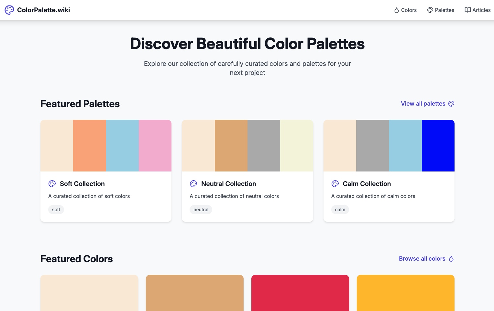
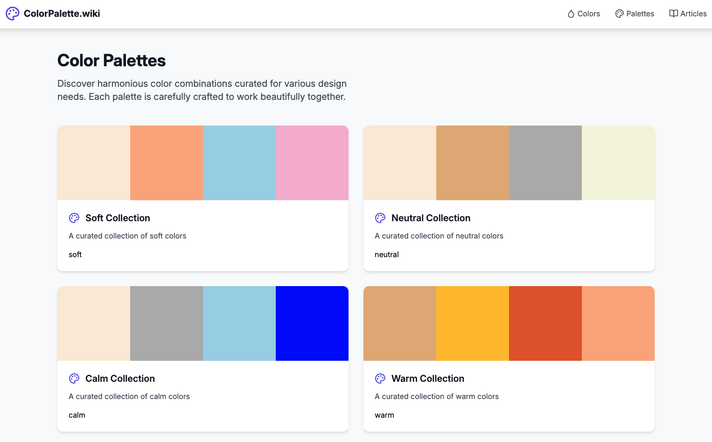

# Color Palettes https://colorpalette.wiki

A modern, feature-rich color palette application built with Astro and React. Browse, explore, and discover beautiful color combinations for your next project.



## Features

- 🎨 **Curated Color Collection**: Handpicked colors with detailed information and usage examples
- 🔍 **Smart Filtering**: Filter colors by tags and categories
- 📚 **Color Articles**: In-depth articles about color theory and trends
- 🎯 **Color Combinations**: Suggested color pairings for each color
- 📱 **Responsive Design**: Beautiful experience across all devices
- ⚡ **Fast Performance**: Built with Astro for optimal loading speeds

## Tech Stack

- **Framework**: [Astro](https://astro.build) with [React](https://reactjs.org)
- **Styling**: [Tailwind CSS](https://tailwindcss.com)
- **Icons**: [Lucide React](https://lucide.dev)
- **Content**: Markdown-based content management
- **Typography**: [Tailwind Typography](https://tailwindcss.com/docs/typography-plugin)

## Project Structure

```
src/
├── components/     # Reusable React components
├── content/        # Markdown content for colors and articles
│   ├── articles/   # Color-related articles
│   └── colors/     # Individual color definitions
├── layouts/        # Page layouts
├── lib/           # Utility functions and data handling
├── pages/         # Route pages
└── styles/        # Global styles and Tailwind config
```

## Color Features

Each color in the system includes:
- Hex code and RGB values
- Usage examples and combinations
- Related color suggestions
- Tagged categories
- Visual preview with different opacities
- Example text applications

## Getting Started

1. Clone the repository:
   ```bash
   git clone https://github.com/temaprint/colorpalette
   ```

2. Install dependencies:
   ```bash
   npm install
   ```

3. Start the development server:
   ```bash
   npm run dev
   ```

4. Build for production:
   ```bash
   npm run build
   ```

## Adding New Colors

Create a new markdown file in `src/content/colors/` with the following structure:

```markdown
---
name: "Color Name"
slug: "color-slug"
hexCode: "#HEXCODE"
tags: ["tag1", "tag2"]
---

# Color Name

Description of the color...

## Psychology

What the color represents...

## Usage

Where to use this color...

## Combinations

Colors that pair well...
```

## Adding Articles

Create a new markdown file in `src/content/articles/` with:

```markdown
---
title: "Article Title"
slug: "article-slug"
date: "YYYY-MM-DD"
hexCode: "#HEXCODE"
description: "Brief description"
featured: true/false
---

Article content...
```

## Contributing

1. Fork the repository
2. Create a feature branch
3. Commit your changes
4. Push to the branch
5. Open a Pull Request

## License

MIT License - feel free to use this project for your own purposes.

## Acknowledgments

- Font: [Inter](https://rsms.me/inter/) by Rasmus Andersson
- Icons: [Lucide](https://lucide.dev/)
- Color Theory Resources: Various color psychology and design resources